# Hashpic

Hashpic creates an image from the *MD5* hash of your input.

Since _v0.2.0_ it is also possible to create an image from a *SHA-512* hash.

Since _v0.4.8_ it is also possible to create an image from a *SHAKE-256* hash with variable digest length of _4_, _9_, _16_, _25_, _36_, _64_, _100_, _144_, _225_ or _255_.

Since _v0.3.5_ it is also possible to create an image from a *SHA3-512* and a *BLAKE2b* hash.

Since _v0.4.0_ it is possible to create an image as *SVG*, which is much faster.

## Install

`pip3 install hashpic`

## Usage

```bash
python3 -m hashpic 'Hashpic rocks!'
```

This should create a file `output.png` in your current directory. 
The input `Hashpic rocks!` should create the following image:


## Piping from another program

All this commands should produce the same image as above.

```bash
printf 'Hashpic rocks!' | md5 | python3 -m hashpic --bypass

printf 'Hashpic rocks!' | python3 -m hashpic
```

## SVG Mode 🎉🎉🎉

Since _v0.4.0_ it is possible to create an image as *SVG*. The following command will create a file `output.svg` in your current directory. 

```bash
python3 -m hashpic 'Hashpic rocks!' --svg
```


Since _v0.5.0_ it is possible to create circles instead of squares. But this is limited to the `SVG Mode`.

```bash
python3 -m hashpic 'Hashpic rocks!' --svg --round
```

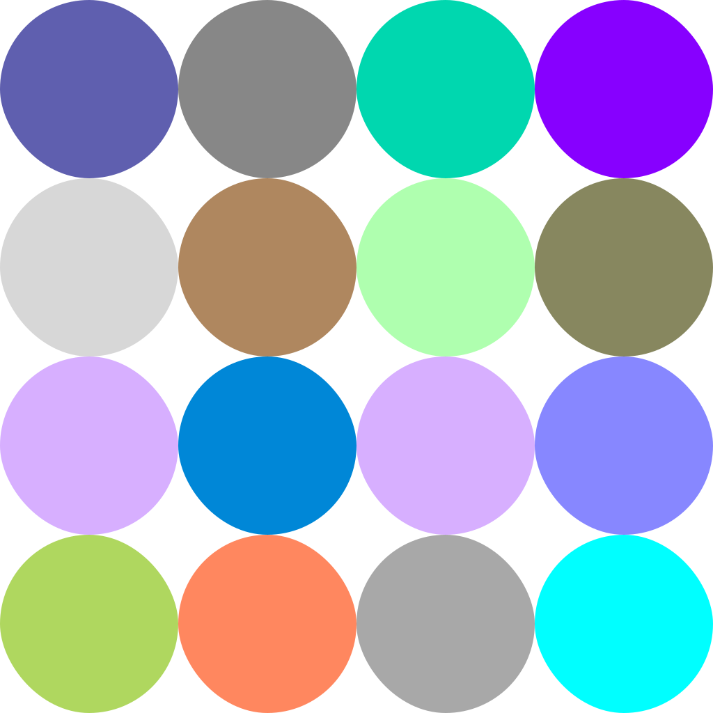

## Console Mode

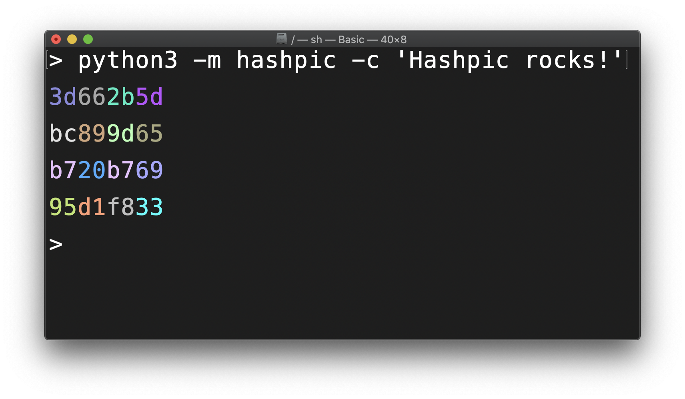

## Hashing a file

It is also possible to create an image from a hash of a file. Use the `--file` argument for that.

```bash
python3 -m hashpic --file README.md
```

## SHA-512 Mode

It is also possible to create an image from a *SHA-512* hash. All arguments for *MD5 Mode* are also available for *SHA512 Mode*.

```bash
python3 -m hashpic --sha512 'Hashpic rocks!'

printf 'Hashpic rocks!' | python3 -m hashpic --sha512
```

This commands should create the following image:

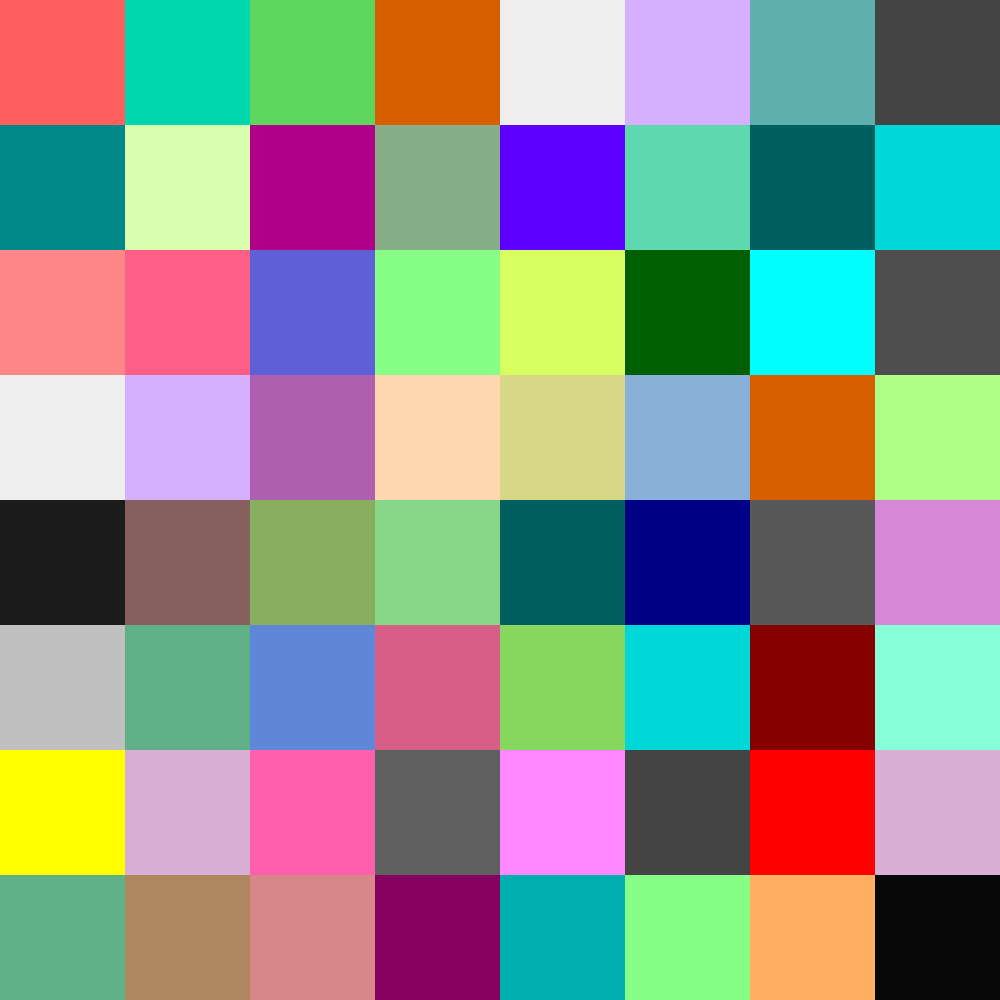

## SHAKE256 Mode

You can create an image from a *SHAKE256* hash with variable digest lengths. Valid lengths are _4_, _9_, _16_, _25_, _36_, _64_, _100_, _144_, _225_ and _255_. You must specify the length of the digest if you want to create an image from a *SHAKE256* hash.

```bash
python3 -m hashpic --shake256 --length 100 'Hashpic rocks!'
```

The command above should produce the following image:

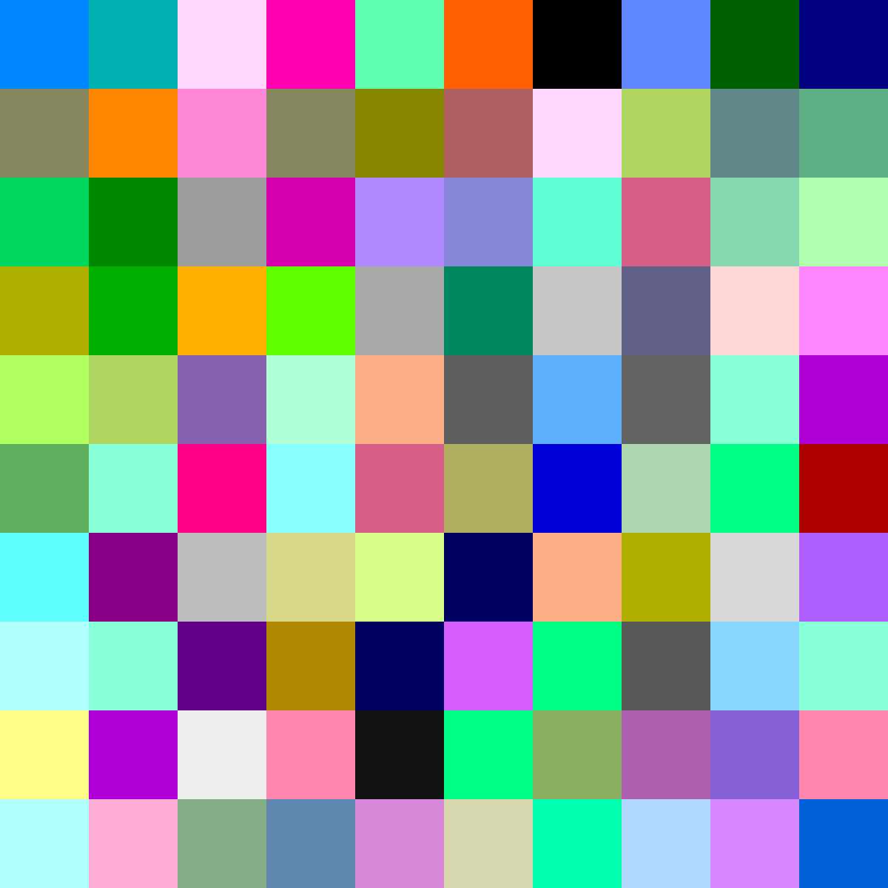

<details>
  <summary>The --slow flag</summary>

#### `--slow` flag

You can use the `--slow` flag to run a generalized method instead of a hardcoded one. But this have some performance issues.

Hardcoded:

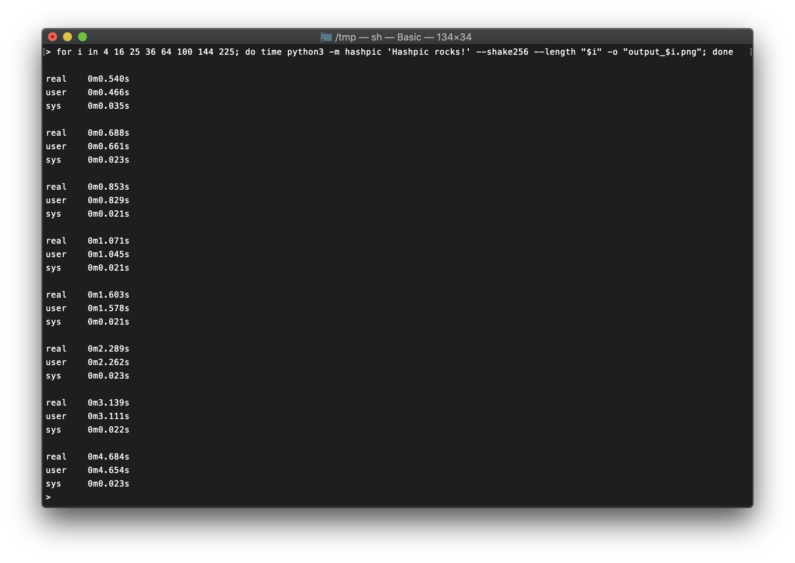

Generalized:

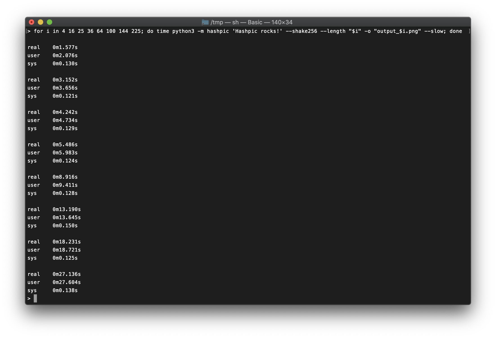

Since _v0.4.0_ it is possible to create an image as *SVG*. Creating SVG files is blazingly fast:

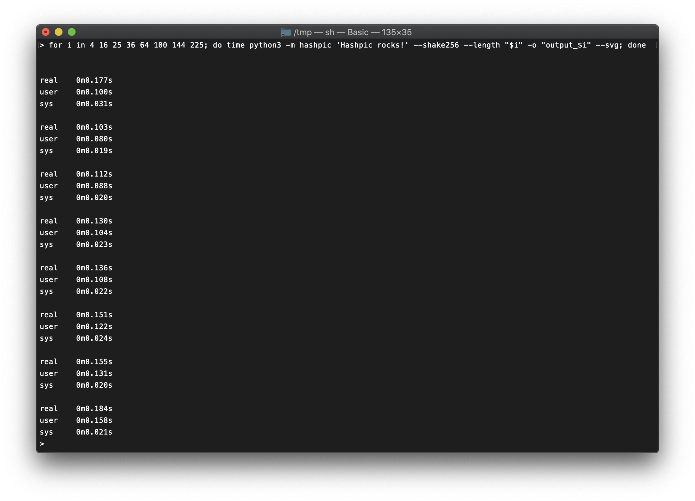

</details>

### More SHAKE256 examples

<details>
  <summary>Click to see more examples.</summary>

  ### Digest Length of 4
  
  ```bash
  python3 -m hashpic --shake256 --length 4 'Hashpic rocks!'
  ```

  

  ### Digest Length of 9
  
  ```bash
  python3 -m hashpic --shake256 --length 9 'Hashpic rocks!'
  ```

  

  ### Digest Length of 16

  ```bash
  python3 -m hashpic --shake256 --length 16 'Hashpic rocks!'
  ```
  

  ### Digest Length of 25

  ```bash
  python3 -m hashpic --shake256 --length 25 'Hashpic rocks!'
  ```

  

  ### Digest Length of 36

  ```bash
  python3 -m hashpic --shake256 --length 36 'Hashpic rocks!'
  ```

  

  ### Digest Length of 64

  ```bash
  python3 -m hashpic --shake256 --length 64 'Hashpic rocks!'
  ```

  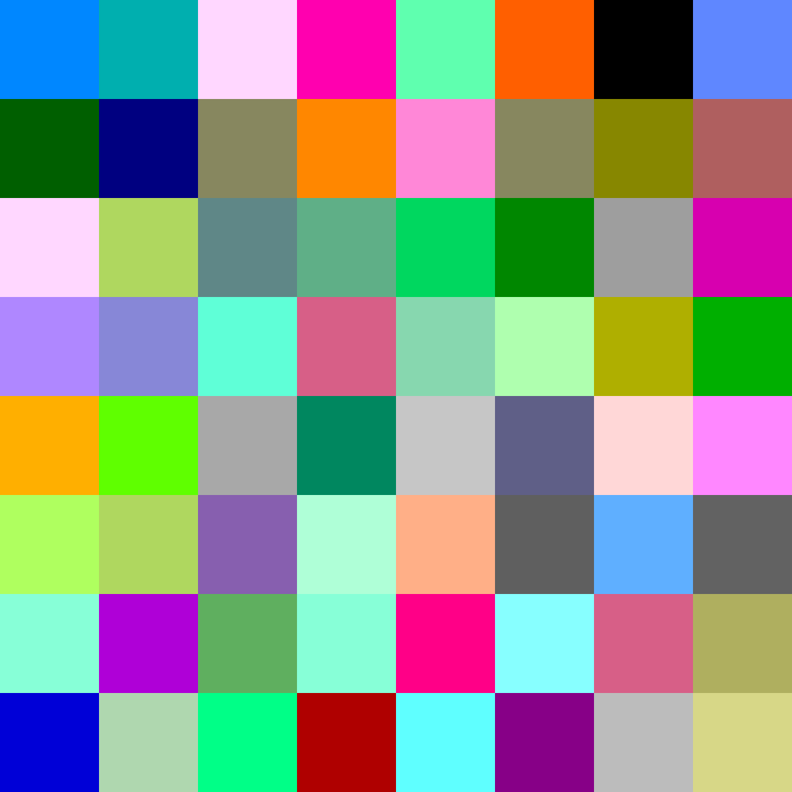

  ### Digest Length of 100

  ```bash
  python3 -m hashpic --shake256 --length 100 'Hashpic rocks!'
  ```

  

  ### Digest Length of 144

  ```bash
  python3 -m hashpic --shake256 --length 144 'Hashpic rocks!'
  ```

  

  ### Digest Length of 225

  Maybe this command will take a few seconds to complete.

  ```bash
  python3 -m hashpic --shake256 --length 225 'Hashpic rocks!'
  ```

  

  ### Digest Length of 255

  This command will take a lot more seconds to complete because it uses currently the slower generic method to create the image. It also adds a `padding byte of 0xff` to the end of the hash to fit it into a `16x16 grid`. Please keep this in mind.

  ```bash
  python3 -m hashpic --shake256 --length 255 'Hashpic rocks!'
  ```

  
</details>
<hr/>

## SHA3 Mode

It is possible to create an image from a *SHA3* hash. 

```bash
python3 -m hashpic 'Hashpic rocks!' --sha3
```

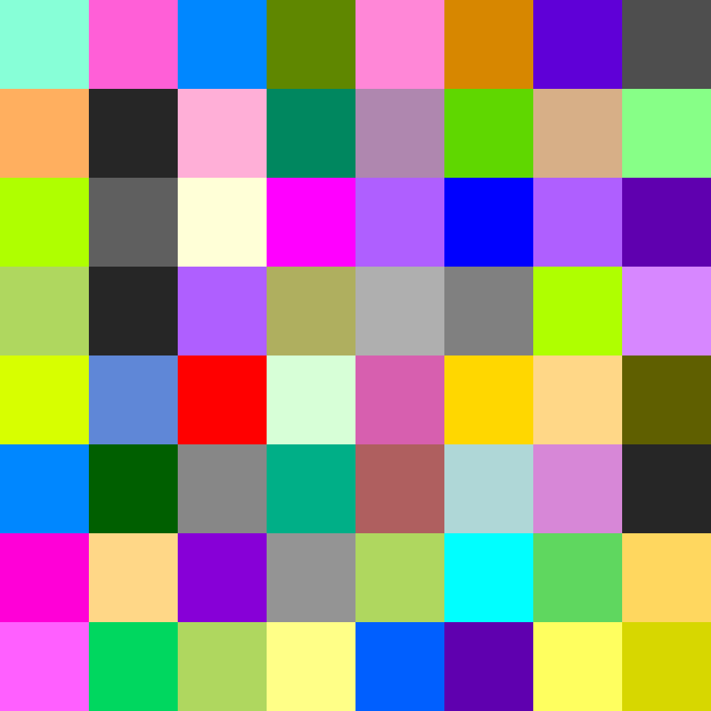

## BLAKE2b Mode

It is possible to create an image from a *BLAKE2b* hash. 

```bash
python3 -m hashpic 'Hashpic rocks!' --blake2b
```

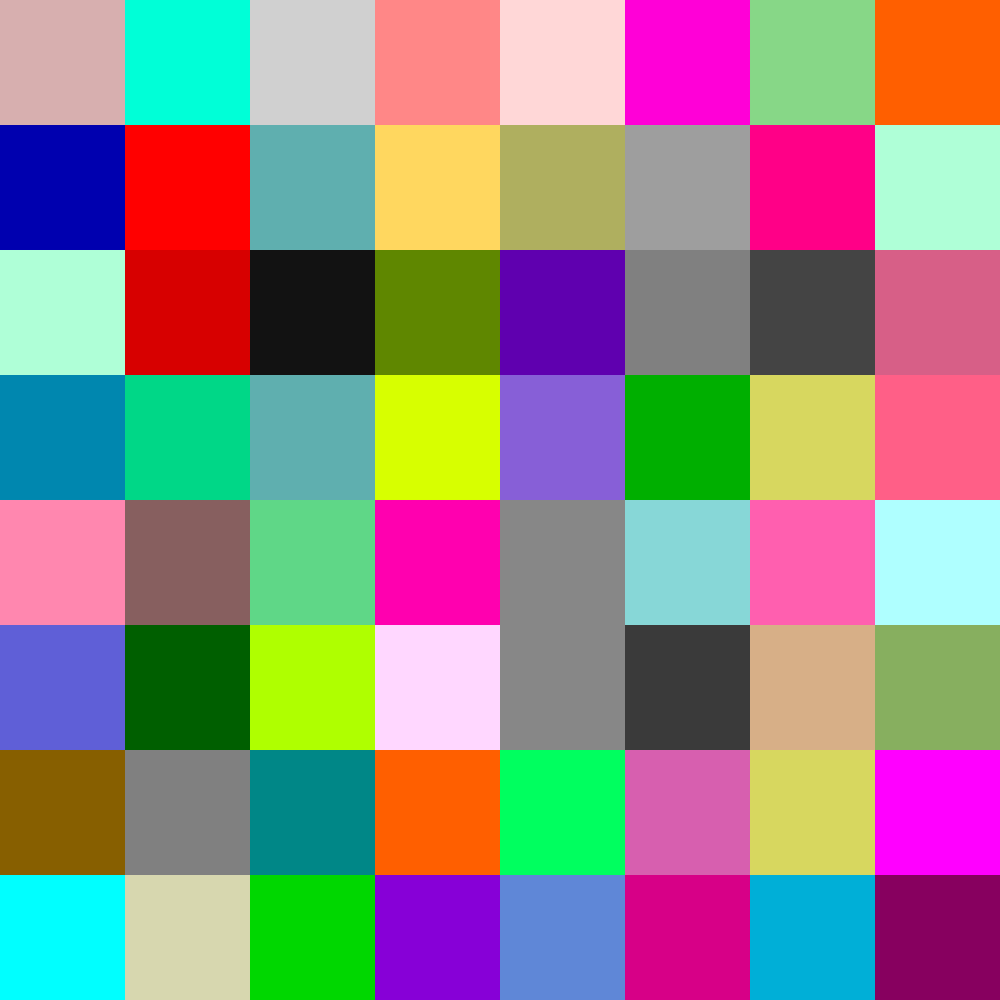

## Using with Docker

Since _v0.4.4_ there is a dockerized version available on [`ghcr.io`](https://github.com/0xflotus/hashpic/pkgs/container/hashpic). You can pull the image from there and use it e.g.:

```bash
docker run -it -v "$(pwd)":/app --rm ghcr.io/0xflotus/hashpic:0.4.4 deadbeef --bypass --shake256 --length 4
```

You can also pipe to docker:

```bash
printf 'ff0030ffe589b7a4e1320f12c4c8de73' | docker run -i --rm ghcr.io/0xflotus/hashpic:0.4.6 -c --shake256 --length 16 --bypass
```

## Examples

Bypassing a hash directly:

```bash
python3 -m hashpic ff00ff00ff00ff0000ff00ff00ff00ffff00ff00ff00ff0000ff00ff00ff00ffff00ff00ff00ff0000ff00ff00ff00ffff00ff00ff00ff0000ff00ff00ff00ff --bypass --sha512
```

This command will produce the following image:


So we can call the hash above the so called `chessboard hash`.

<hr>

You can also bypass a hash from another program:

```bash
printf 'Hashpic rocks!' | sha512sum | awk '{print $1}' | python3 -m hashpic --sha512 -c --bypass 
```

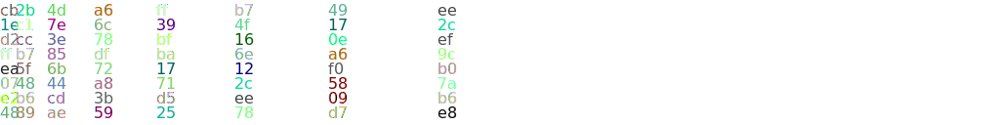

<hr>

With all this in mind you can also use hashpic to create an image not only from a hash but e.g. from the current time in hex:

```bash
python3 -c "import time; print(hex(int(time.time()))[2:])" | python3 -m hashpic --shake256 --length 4 --bypass
```

Or e.g. an IP address in hexadecimal form:

```bash
# localhost hex(127.0.0.1) == 7f000001
python3 -m hashpic 7f000001 --shake256 --length 4 --bypass

# e.g. an IPv6 address of Googles DNS server
printf 2001:4860:4860:0000:0000:0000:0000:8844 | tr -d ':' | python3 -m hashpic --bypass 
```

## Disclaimer

The color palette in [`data.py`](./hashpic/data.py) was influenced by the [`string-color`](https://gitlab.com/shindagger/string-color) library. 
Thanks for this!
