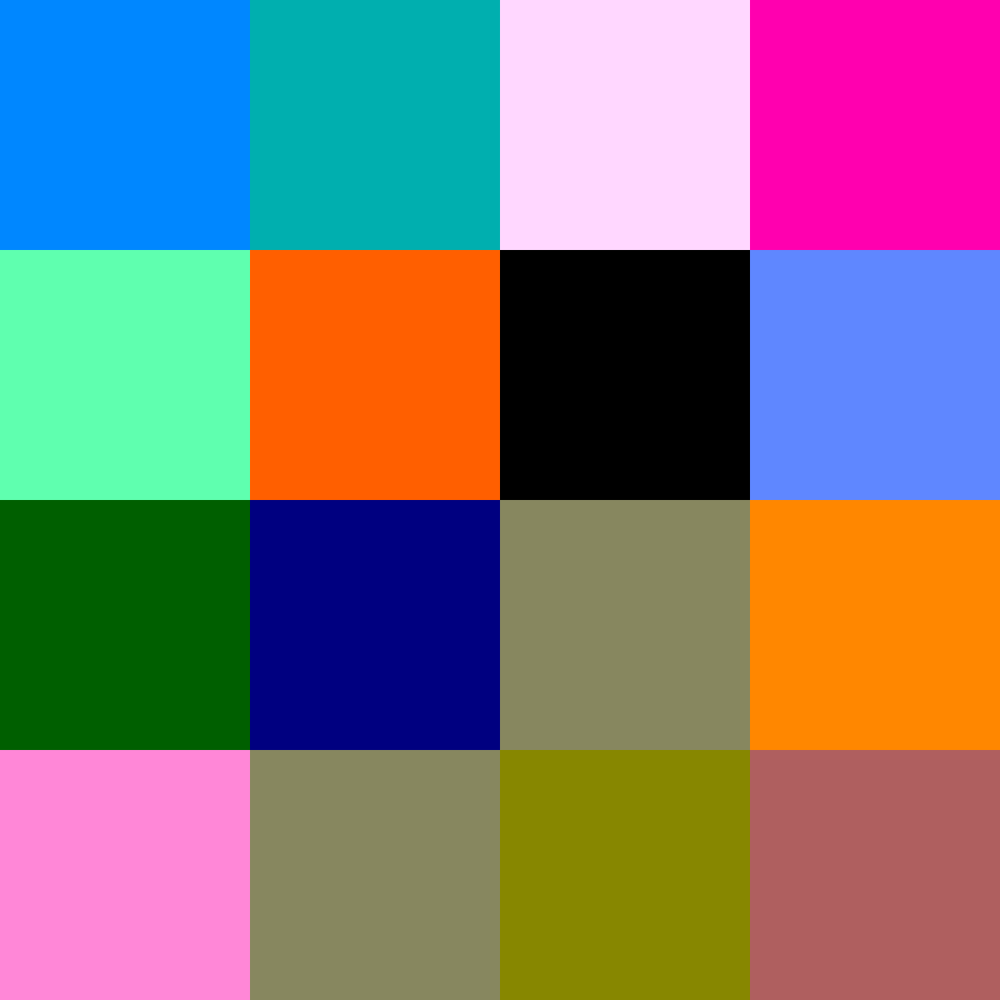
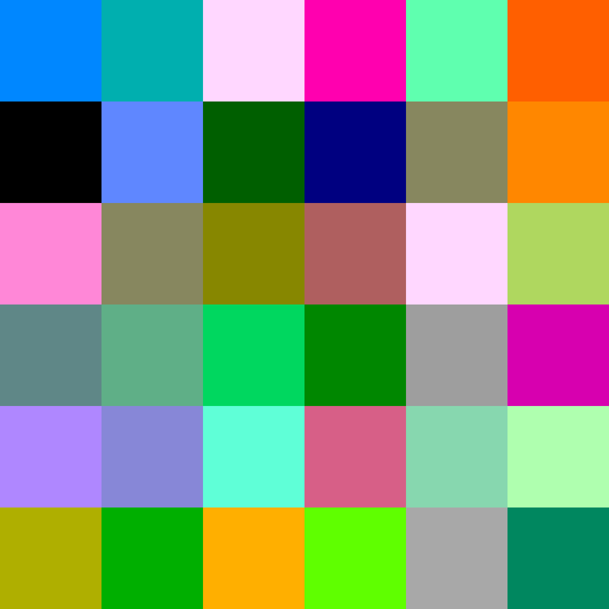
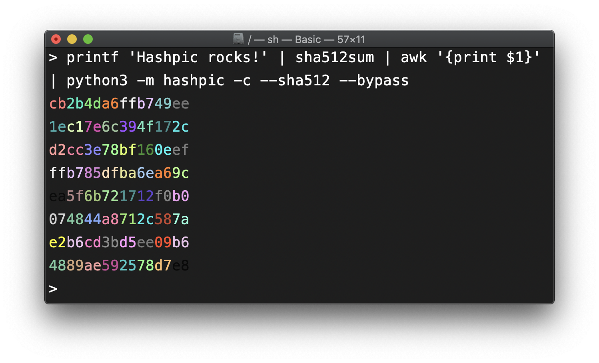

# Hashpic

Hashpic creates an image from the *MD5* hash of your input.

Since _v0.2.0_ it is also possible to create an image from a *SHA-512* hash.

Since _v0.3.0_ it is also possible to create an image from a *SHAKE-256* hash with variable digest length of _4_, _16_, _25_, _36_, _64_, _100_ or _225_.

### Install

`pip3 install hashpic`

### Usage

```bash
> python3 -m hashpic 'Hashpic rocks!'
```

This should create a file `output.png` in your current directory. 
The input `Hashpic rocks!` should create the following image:


#### Piping from another program

All this commands should produce the same image as above.

```bash
> printf 'Hashpic rocks!' | md5 | python3 -m hashpic --bypass

> printf 'Hashpic rocks!' | python3 -m hashpic
```

#### Console Mode


#### SHA-512 Mode

It is also possible to create an image from a *SHA-512* hash. All arguments for *MD5 Mode* are also available for *SHA512 Mode*.

```bash
> python3 -m hashpic --sha512 'Hashpic rocks!'

> printf 'Hashpic rocks!' | python3 -m hashpic --sha512
```

This commands should create the following image:


#### SHAKE256 Mode

You can create an image from a *SHAKE256* hash with variable digest lengths. Valid lengths are _4_, _16_, _25_, _36_, _64_, _100_ and _225_. You must specify the length of the digest if you want to create an image from a *SHAKE256* hash.

```bash
> python3 -m hashpic --shake256 --length 100 'Hashpic rocks!'
```

The command above should produce the following image:


## More SHAKE256 examples

<details>
  <summary>Click to see more examples.</summary>

  ### Digest Length of 4
  
  ```bash
  > python3 -m hashpic --shake256 --length 4 'Hashpic rocks!'
  ```

  

  ### Digest Length of 16

  ```bash
  > python3 -m hashpic --shake256 --length 16 'Hashpic rocks!'
  ```
  

  ### Digest Length of 25

  ```bash
  > python3 -m hashpic --shake256 --length 25 'Hashpic rocks!'
  ```

  

  ### Digest Length of 36

  ```bash
  > python3 -m hashpic --shake256 --length 36 'Hashpic rocks!'
  ```

  

  ### Digest Length of 64

  ```bash
  > python3 -m hashpic --shake256 --length 64 'Hashpic rocks!'
  ```

  

  ### Digest Length of 225

  Maybe this command will take a few seconds to complete.

  ```bash
  > python3 -m hashpic --shake256 --length 225 'Hashpic rocks!'
  ```

  
</details>
<hr/>

## Examples

Bypassing a hash directly:

```bash
> python3 -m hashpic ff00ff00ff00ff0000ff00ff00ff00ffff00ff00ff00ff0000ff00ff00ff00ffff00ff00ff00ff0000ff00ff00ff00ffff00ff00ff00ff0000ff00ff00ff00ff --bypass --sha512
```

This command will produce the following image:


So we can call the hash above the so called `chessboard hash`.

You can also bypass a hash from another program:



### Disclaimer

The color palette in `data.py` was copied from and influenced by the [`string-color`](https://pypi.org/project/string-color/) library. 
Thanks for this!
